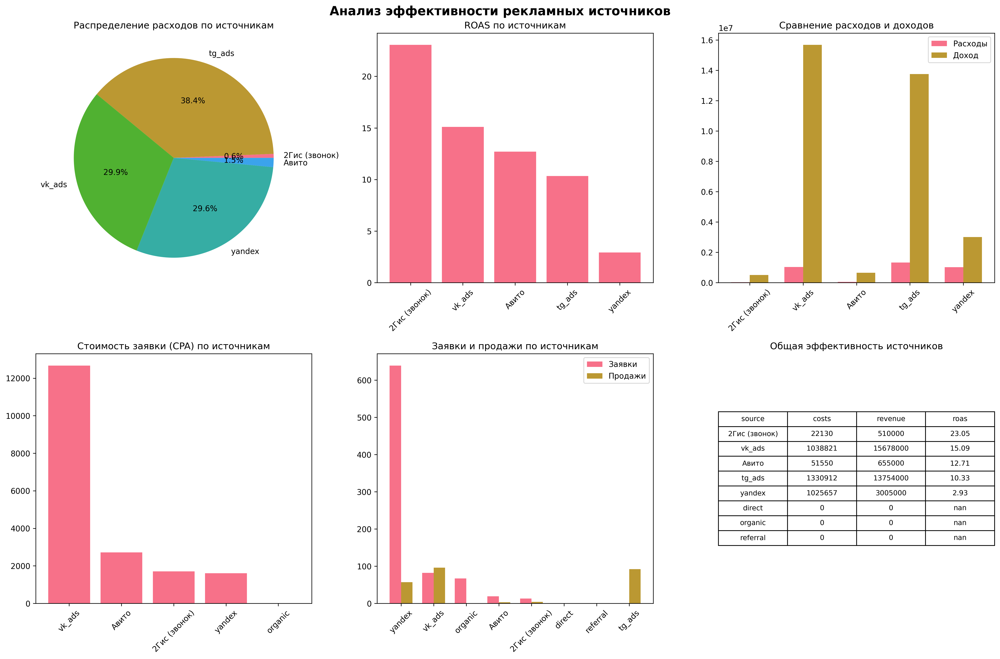

# Дашборд Анализ эффективности рекламных источников

## Визуализация результатов

### Общий дашборд

Рисунок 1 Визуализация ключевых метрик эффективности рекламных каналов.

## Сводная таблица с метриками эффективности

| Источник        | Расходы (руб.) | Клики | Заявки | CPA (руб.) | Продажи | Выручка (руб.) | ROAS |
|----------------|---------------|-------|--------|------------|---------|----------------|------|
| yandex         | 1,025,657     | 16,179| 639    | 1,605.10   | 57      | 3,005,000      | 2.93 |
| vk_ads         | 1,038,821     | 14,754| 82     | 12,668.55  | 96      | 15,678,000     | 15.09|
| tg_ads         | 1,330,912     | 13,127| 0      | N/A        | 92      | 13,754,000     | 10.33|
| Авито          | 51,550        | 0     | 19     | 2,713.16   | 3       | 655,000        | 12.71|
| 2Гис (звонок)  | 22,130        | 0     | 13     | 1,702.31   | 4       | 510,000        | 23.05|
| organic        | 0             | 0     | 67     | 0.00       | 0       | 0              | N/A  |
| direct         | 0             | 0     | 0      | N/A        | 0       | 0              | N/A  |
| referral       | 0             | 0     | 0      | N/A        | 0       | 0              | N/A  |

## Ключевые выводы
*   **Наибольшие расходы** приходятся на tg_ads (1,330,912 руб.) и vk_ads (1,038,821 руб.).
*   **Лучший ROAS** у источника "2Гис (звонок)" — 23.05 (23 рубля дохода на каждый вложенный рубль).
*   **Organic-трафик** генерирует 67 заявок без каких-либо расходов.
*   **Яндекс.Директ** обеспечивает наибольшее количество заявок (639).
*   **Самая высокая стоимость заявки** у vk_ads — 12,668.55 руб.

## Инструкция по запуску
1.  Установите зависимости `pip install pandas numpy matplotlib seaborn openpyxl`
2.  Поместите файл с исходными данными в папку со скриптом.
3.  Запустите скрипт `python marketing_analysis.py`

Подробная информация о процессе анализа и код находятся в файле `marketing_analysis.py`.
